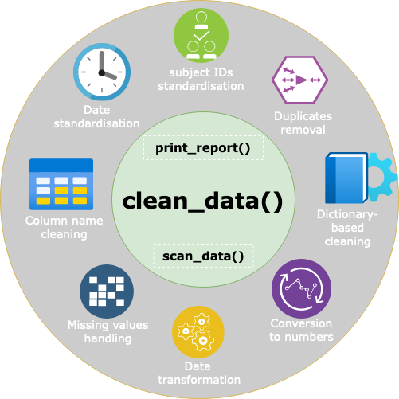

```{r, include = FALSE}
knitr::opts_chunk$set(
  collapse = TRUE,
  comment  = "#>"
)
```

## Concept and motivation

{cleanepi} is an R package crafted to clean, curate, and standardize tabular datasets, with a particular focus on epidemiological data.
Data cleaning is an important phase in data analysis and modelling pipelines. The procedures entailed in the cleaning process may differ based on the data type and research objectives. Nonetheless, certain steps can be applied universally across diverse data types.

In this document, we outline the design decisions that have steered the development strategies of the {cleanepi} R package, along with the rationale behind each decision and the potential advantages and disadvantages associated with them.

## Design decisions

The {cleanepi} R package is designed to offer functional programming-style data cleansing tasks. To streamline the organization of data cleaning operations, we have categorized them into distinct groups referred to as **modules**. These modules are based on overarching goals derived from commonly anticipated data cleaning procedures. Each module features a primary function along with additional helper functions tailored to accomplish specific tasks. It's important to note that, except for few cases where the outcome from a helper function can impact on the cleaning task, only the main function of each module will be exported. This deliberate choice enables users to execute individual cleaning tasks as needed, enhancing flexibility and usability.

Every function in {cleanepi} is named such that it reflects the action that it does. Functions with a similar effect have a name that starts with the same prefix. The current version of the package contains the following semantic prefixes:

*   `add_` is used to in functions that are made to add something to an existing object
*   `correct_` is used to correct existing values
*   `convert_` is used in the two functions that aim at converting values from one type to another
*   `standardize_` is used to transform some values for compliance with a predefined standard
*   `clean_` is used in `clean_data()` and `clean_using_dictionary()`. It's primary used to define functions that operate on multiple columns.
*   `check_` is used in functions that check whether some values comply with expectations, without transforming them
*   `remove_` is used in functions that remove some rows or columns from the input dataset
    
There are also other functions names that fall outside of this semantic nomenclature due to their the specific nature of their actions: `replace_missing_values()`, `scan_data()`, `find_duplicates()`, `print_report()`, `get_default_params()`


{align="center"}

At the core of {cleanepi}, the pivotal function `clean_data()` serves as a wrapper encapsulating all the modules, as illustrated in the figure above. This function is intended to be the primary entry point for users seeking to clean their data. It performs the cleaning operations as requested by the user through the set of parameters that need to be explicitly defined. Furthermore, multiple cleaning operations can be performed sequentially using the pipe operators (`%>%` or `|>` for users of R version 4.1 and above). In addition, this package also has two surrogate functions:

1.  `scan_data()`: This function enables users to assess the data types present in each character-valued column of their dataset.
The composition in data types of character columns will inform the user about what actions need to be performed on that column. Most frequent scenarios involve the presence of:

  -   `date` values in either `Date` or `numeric` format (when date column is imported from MS Excel),
  -   character values in a logical column (`not available` within a column of `TRUE` or `FALSE`),
  -   numbers written in letters.
2.  `print_report()`: For visualizing the report generated from each applied cleaning task, facilitating transparency and understanding of the data cleaning process.

When the input data contains character columns, `scan_data()` returns a data frame with the same number of rows as the character columns and six columns representing: The given names, proportion of missing, numeric, date, character, and logical values, respectively, for the character-valued columns. We transpose the result relative to the input dataset (columns in the input are returned as row) to avoid horizontal scrolling in the case of datasets with a large number of character columns. The sum of the proportion across all columns is not always equal to `1`; because when numeric values are found in a character column, they will be subjected to the followings:

a.  Conversion into Date using `lubridate::as_date()` with `origin = as.Date("1900-01-01")`.
b.  Conversion into Date using `date_guess()` function used by the `standardize_dates()` function.

Numeric values that are successfully converted into date from either of the methods above are considered as potential dates. They will be added to the date count if they fall within interval of 50 years back from the date of the process.


> **Note that** there is no ambiguity for the columns of type Date, logical, and numeric. values in such columns are expected to be of the same type. Hence, the `scan_data()` function will not be applied on columns other than character columns. Consequently, it  returns `NA` when applied on a dataset with no character columns and print out a message about the absence of character columns from the input dataset.


## Scope

 The data cleaning operations are categorized into modules, each provides a specific data cleaning task. The modules in the current version of {cleanepi} include:

-   standardization of column names,
-   detection and removal of duplicates,
-   replacement of missing values with `NA`,
-   standardization of subject IDs,
-   standardization of date format,
-   replacement of existing values with predefined ones (dictionary-based substitutions),
-   conversion of values when necessary,
-   verification of the sequence order of date-events, and
-   transformation of selected columns.

By putting these operations into modules, {cleanepi} offers users a systematic and adaptable framework to address diverse data cleaning needs, especially within the realm of epidemiological datasets.

## Input

The primary function of each module, as well as the core function `clean_data()`, accept input in the form of a `data.frame` or `linelist`. This offers flexibility for users regarding where they want to position {cleanepi} within the R package ecosystem for epidemic analysis pipelines, either to clean data before or after converting it to a `linelist`.

In addition to the target dataset, the core function `clean_data()` accepts other parameters that are specific to the cleaning modules. Most of these parameters are provided in a form of a `list`. It internally invokes the primary functions specified in each module.

## Output

Both the primary functions of the modules and the core function `clean_data()` return an object of the same type as the input dataset. Every cleaning operations applied to the input dataset can add an element to the report. The report generated from all cleaning tasks is attached to the output object as an attribute. It can be accessed using the `attr()` or `attributes()` functions in base R.

### Modules in {cleanepi}

In this section, we provide a detailed description of the way that every module is built.

#### 1. Standardization of column names

This module is designed to standardize the style and format of column names within the target dataset, offering users the flexibility to specify a subset of:

-   focal columns to preserve their original format, and
-   columns to be renamed, i.e., given a new name supplied by the user.
-   **Main function:** `standardize_column_names()`
-   **Input:**
    -   A `data.frame` or `linelist` object.
    -   Optional, a `vector` of focal column names and a vector of column names to be renamed in the form of `new_name = "old_name"`. If not provided, all columns will undergo naming standardization.
-   **Output:**
    -   The input object with standardized column names.
-   **Report:**
    -   A two-column table displaying the initial and current column names for each updated column in the original dataset.
-   **Mode:**
    -   Explicit

The function provides means to keep column naming conventions, and thereby enhancing the readability of the dataset.

#### 2. Removal of empty rows and columns and constant columns

This module aims at eliminating irrelevant and redundant rows and columns, including empty rows and columns as well as constant columns. The main function was initially (i.e. up to `version 1.0.2`) built based on the {janitor} R package. We used `janitor::remove_empty()` and `janitor::remove_conatant()` to remove empty rows and columns and constant columns respectively. In `janitor::remove_empty()`, the empty rows are removed first, then the empty columns. This maximizes the chance of keeping more columns after this operation. However, we noticed that the removal of the constant data might still result in a dataset with some empty rows and/or columns and constant columns. Therefore, we introduced the concept of iterative constant data removal in more recent versions of the package (`> v.1.0.2`). This means that the process of removing constant data is performed iteratively until there is no constant data. The report made from this operation informs about what rows and columns were removed at every iteration.

-   **Main function:** `remove_constants()`
-   **Input:** 
    -   Accepts a `data.frame` or `linelist` object, along with:
    -   A cut-off that determines the percent of missing values beyond which a row or column should be deleted.
-   **Output:** 
    -   Returns the input object after applying the specified operations.
-   **Report:**
    -   A data frame with four columns showcasing the removed empty rows and columns and constant columns at every iteration.
-   **Mode:**
    -   explicit

#### 3. Detection and removal of duplicates

This module is designed to identify and eliminate duplicated rows across specific or all columns.

-   **Main functions:** `find_duplicates(), remove_duplicates()`
-   **Input:** 
    -   Accepts a `data.frame` or `linelist` object, along with optional parameters:
    -   Vector of target columns (default is to consider all columns; possible to use `linelist_tags` to consider tagged variables only when the input is a linelist object).
-   **Output:** 
    -   Returns the input object after applying the specified operations.
-   **Report:**
    -   Two table(s) showcasing the found and removed duplicates.
    -   A character vector with the columns used during duplicates removal.
-   **Mode:**
    -   explicit

Through the `remove_duplicates()` function, users can streamline their dataset by eliminating redundant rows, thus enhancing data integrity and analysis efficiency.

#### 4. Replacement of missing values with `NA`

This module aims to standardize and unify the representation of missing values within the dataset.

-   **Main function:** `replace_missing_values()`
-   **Input:** 
    -   Accepts a `data.frame` or `linelist` object, along with:
    -   A `vector` of column names (if not provided, the operation is performed across all columns)
    -   A string or a vector of strings representing the current missing values (default value is `cleanepi::common_na_strings`)
-   **Output:** 
    -   Returns the input object with all missing values represented as `NA`.
-   **Report:** 
    -   Generates a three-column table featuring index, column, and value for each missing item in the dataset.
-   **Mode:**
    -   explicit

By utilizing the `replace_missing_char()` function, users can ensure consistency in handling missing values across their dataset, facilitating accurate analysis and interpretation of the data.

#### 5. Standardization of date values

This module is dedicated to convert date values in character columns into `ISO8601` `Date` format, and ensuring that all dates fall within  a timeframe provided by the user.

-   **Main function:** `standardize_dates()`
-   **Input:** 
    -   Accepts a `data.frame` or `linelist` object, along with:
    -   A `vector` of targeted date columns (automatically determined if not provided)
    -   Tolerance threshold that defines the percentage of missing (missing and out of range values converted to `NA`) values to be allowed in a converted column. When the percentage of the missing values exceeds or is equal to it, the original values are returned (default value is 40%).
    -   format (default value is NULL)
    -   timeframe (default value is null)
-   **Output:** 
    -   Returns the input object with standardized date values formatted as *%Y-%m-%d* (YYYY-MM-DD).
-   **Report:**
    -   A two-column table listing the columns where date values were standardized.
    -   A three-column table featuring index, column name, and values that fall outside the specified timeframe.
    -   A data frame featuring date values that can comply with more than one specified format. Users can update the standardized date values with the correct ones when it's appropriated.
-   **Mode:**
    -   explicit

By employing the `standardize_dates()` function, users can ensure uniformity and coherence in date formats across their dataset, while also validating the temporal integrity of the data within the defined timeframe.

#### 6. Standardization of subject IDs

This module is tailored to verify whether the values in the column uniquely identifying subjects adhere to a consistent format. It also offers a functionality that allows users to correct the inconsistent subject IDs.

-   **Main function:** `check_subject_ids()`
-   **Input:**
    -   Accepts a `data.frame` or `linelist` object, along with:
    -   The name of the id column,
    -   Strings for prefix, suffix,
    -   A numerical range within the IDs,
    -   An integer representing the expected number of characters in a subject ID.
-   **Output:** 
    -   Returns the input object with standardized subject IDs.
-   **Report:** 
    -   Generates a two-column table featuring index and value of each subject ID that deviates from the expected format.
-   **Mode:**
    -   explicit

The `correct_subject_ids()` function can be used to correct the identified incorrect subject ids. In addition to the input data, it expects a data frame with two columns `from` and `to` containing the wrong and the correct ids respectively.

By utilizing the functions in this module, users can ensure uniformity in the format of subject IDs, facilitating accurate tracking and analysis of individual subjects within the dataset.

#### 7. Dictionary based substitution

This module facilitates dictionary-based substitution, which involves replacing existing values with predefined ones. It replaces entries in a specific columns to certain values, such as substituting 1 with “male” and 2 with “female” in a gender column. It also interoperates seamlessly with the `get_meta_data()` function from {readepi} R package.

Note that the `clean_using_dictionary()` function will return a warning when it detects values in the target columns, which are not mentioned in the data dictionary. These undeclared values can be added to the data dictionary using the `add_to_dictionary()` function.

-   **Main function:** `clean_using_dictionary()`
-   **Input:** 
    -   Accepts a `data.frame` or `linelist` object, along with:
    -   A data dictionary featuring the following column names: *options*, *values*, and *order*.
-   **Output:** 
    -   Returns the input object where the specified options are replaced by their corresponding values.
-   **Report:** 
    -   Generates a three-column table with index, column, and value for each undeclared value encountered in a targeted column.
-   **Mode:**
    -   explicit

By leveraging the `clean_using_dictionary()` function, users can streamline and standardize the values within specific columns based on predefined mappings, enhancing consistency and accuracy in the dataset.

#### 8. Conversion of values when necessary

This module is designed to convert numbers written in letters to numerical values, ensuring interoperability with the [{numberize}](https://epiverse-trace.github.io/numberize/) package.

-   **Main function:** `convert_to_numeric()`
-   **Input:** 
    -   Accepts a `data.frame` or `linelist` object, along with:
    -   A vector of column names to be converted into numeric. When not provided, the target columns are identified from the output of the `scan_data()` function,
    -   A string that denotes the language used in the text. The current version supports **English (en)**, **French (fr)** and **Spanish (es)**.
-   **Output:** 
    -   Returns the input object with values in the target columns converted into numeric format.
-   **Report:** 
    -   Generates a three-column table with index, column, and value for each unrecognized value in the dataset (strings that could not be converted into numeric).
-   **Mode:**
    -   explicit

By employing the `convert_to_numeric()` function, users can seamlessly transform numeric representations written in letters into numerical values, ensuring compatibility with the {numberize} package and promoting accuracy in numerical analysis.

#### 9. Verification of the sequence of date-events

This module provides functions to verify whether the sequence of date events aligns with expectations. For instance, it can flag rows where the date of admission to the hospital precedes the individual's date of birth.

-   **Main function:** `check_date_sequence()`
-   **Input:** 
    -   Accepts a `data.frame` or `linelist` object, along with:
    -   A vector of date column names to be considered
-   **Output:** 
    -   Returns the input object and sends a message to inform about the presence of rows where the expected sequence of dates is not respected.
-   **Report:** 
    -   Generates a table listing the incorrect rows from the specified columns.
-   **Mode:**
    -   explicit

By using the `check_date_sequence()` function, users can systematically validate and ensure the coherence of date sequences within their dataset, promoting accuracy and reliability in subsequent analyses.

#### 10. Transformation of selected columns

This module is dedicated to performing various specialized operations related to epidemiological data analytics. In the current version of the package, this module includes the following functions:

-   **Main function:** `timespan()`
-   **Input:** 
    -   Accepts a `data.frame` or `linelist` object, along with:
    -   The name of the column of interest,
    -   The reference date value or column,
    -   The time and remainder units (possible values are “days”, “weeks”, “months”, or “years”),
    -   The names of the newly generated columns
-   **Output:** 
    -   Returns the input object with clean data and one or two additional columns with values in the specified time unit.
-   **Report:**
    -   None.
-   **Mode:**
    -   explicit

By leveraging the `timespan()` function, users can efficiently compute and integrate time span information into their epidemiological dataset based on user-defined parameters, enhancing the analytics capabilities of the dataset.

### Surrogate functions

1.  `scan_data()`: This function is designed to generate a quick summary of the dataset, offering insights into the composition of each character column. It calculates the percentage of values belonging to different data types such as character, numeric, missing, logical, and date. This summary can help analysts and data scientists understand the structure and content of the dataset at a glance.

2.  `print_report()`: This function is used for displaying the report detailing the result of the cleaning operations executed on the dataset. It likely presents information about the data cleaning processes performed, such as handling missing values, correcting data types, removing duplicates, and any other transformations applied to ensure data quality and integrity.

These surrogate functions play crucial roles in the data analysis and cleaning workflow, providing valuable information and documentation about the dataset characteristics and the steps taken to prepare it for analysis or modelling.

## Related packages

[{janitor}](https://CRAN.R-project.org/package=janitor), [{matchmaker}](https://CRAN.R-project.org/package=matchmaker), [{naniar}](https://CRAN.R-project.org/package=naniar), [{daiquiri}](https://CRAN.R-project.org/package=daiquiri) [{epiCleanr}](https://CRAN.R-project.org/package=epiCleanr)

## Dependencies

The modules and the surrogate functions depend on the following packages:

[{numberize}](https://github.com/epiverse-trace/numberize) used for the conversion of number from character to numeric, [{dplyr}](https://CRAN.R-project.org/package=dplyr) used in many ways including filtering, column creation, data summary, etc, [{magrittr}](https://CRAN.R-project.org/package=magrittr) used here for its `%>%` operator,
[{linelist}](https://CRAN.R-project.org/package=linelist) used to perform some operations on linelist-type input objects, [{matchmaker}](https://CRAN.R-project.org/package=matchmaker) utilized to perform the dictionary-based cleaning, [{lubridate}](https://CRAN.R-project.org/package=dplyr) used to create, handle, and manipulate objects of type Date, [{reactable}](https://CRAN.R-project.org/package=reactable) mainly used here to customize the data cleaning report,
[{cli}](https://CRAN.R-project.org/package=cli) utilized to reformat all the messages in the package (from version 1.1.0 and above),
[{rlang}](https://CRAN.R-project.org/package=rlang) used here for its `.data` functionality to retrieve data-variables from the data frame, [{readr}](https://CRAN.R-project.org/package=readr) used to import data, [{janitor}](https://CRAN.R-project.org/package=janitor) used to standardize column names in `standardize_column_names()`,
[{tibble}](https://CRAN.R-project.org/package=tibble) used to work tibbles.
[{naniar}](https://CRAN.R-project.org/package=tibble) used to for its predefined set of common missing value strings.

The functions will require other packages that are needed in the package development process including:

[{checkmate}](https://CRAN.R-project.org/package=checkmate), [{kableExtra}](https://CRAN.R-project.org/package=kableExtra), [{bookdown}](https://CRAN.R-project.org/package=bookdown), [{rmarkdown}](https://CRAN.R-project.org/package=rmarkdown), [{testthat}](https://CRAN.R-project.org/package=testthat) (\>= 3.0.0), [{knitr}](https://CRAN.R-project.org/package=knitr), [{lintr}](https://CRAN.R-project.org/package=lintr),
[{potools}](https://CRAN.R-project.org/package=potools)
[{systemfonts}](https://CRAN.R-project.org/package=systemfonts)

## Contribute

There are no special requirements to contributing to {cleanepi}, please follow the [package contributing guide](https://github.com/epiverse-trace/.github/blob/main/CONTRIBUTING.md).
